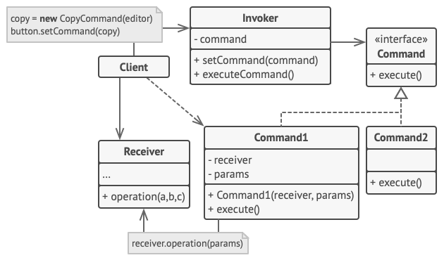

# 命令模式

命令模式（Command Pattern）是一种数据驱动的设计模式，它属于行为型模式。请求以命令的形式包裹在对象中，并传给调用对象。调用对象寻找可以处理该命令的合适的对象，并把该命令传给相应的对象，该对象执行命令。

## 介绍

**意图：**将一个请求封装成一个对象，从而使您可以用不同的请求对客户进行参数化。

**主要解决：**在软件系统中，行为请求者与行为实现者通常是一种紧耦合的关系，但某些场合，比如需要对行为进行记录、撤销或重做、事务等处理时，这种无法抵御变化的紧耦合的设计就不太合适。

**何时使用：**在某些场合，比如要对行为进行"记录、撤销/重做、事务"等处理，这种无法抵御变化的紧耦合是不合适的。在这种情况下，如何将"行为请求者"与"行为实现者"解耦？将一组行为抽象为对象，可以实现二者之间的松耦合。

**如何解决：**通过调用者调用接受者执行命令，顺序：调用者→命令→接受者。

**关键代码：**定义三个角色：1、received 真正的命令执行对象 2、Command 3、invoker 使用命令对象的入口

**应用实例：**struts 1 中的 action 核心控制器 ActionServlet 只有一个，相当于 Invoker，而模型层的类会随着不同的应用有不同的模型类，相当于具体的 Command。

**优点：** 1、降低了系统耦合度。 2、新的命令可以很容易添加到系统中去。

**缺点：**使用命令模式可能会导致某些系统有过多的具体命令类。

**使用场景：**认为是命令的地方都可以使用命令模式，比如： 1、GUI 中每一个按钮都是一条命令。 2、模拟 CMD。

**注意事项：**系统需要支持命令的撤销(Undo)操作和恢复(Redo)操作，也可以考虑使用命令模式，见命令模式的扩展。

命令模式结构示意图:

命令模式结构

**发送者**（Sender）——亦称“触发者（Invoker）”——类负责对请求进行初始化，其中必须包含一个成员变量来存储对于命令对象的引用。发送者触发命令，而不向接收者直接发送请求。注意，发送者并不负责创建命令对象：它通常会通过构造函数从客户端处获得预先生成的命令。

**命令**（Command）接口通常仅声明一个执行命令的方法。

**具体命令**（Concrete Commands）会实现各种类型的请求。具体命令自身并不完成工作， 而是会将调用委派给一个业务逻辑对象。但为了简化代码，这些类可以进行合并。

接收对象执行方法所需的参数可以声明为具体命令的成员变量。 你可以将命令对象设为不可变， 仅允许通过构造函数对这些成员变量进行初始化。

**接收者**（Receiver）类包含部分业务逻辑。几乎任何对象都可以作为接收者。绝大部分命令只处理如何将请求传递到接收者的细节，接收者自己会完成实际的工作。

**客户端**（Client）会创建并配置具体命令对象。客户端必须将包括接收者实体在内的所有请求参数传递给命令的构造函数。此后，生成的命令就可以与一个或多个发送者相关联了。

## 实现

我们首先创建作为命令的接口 *Order*，然后创建作为请求的 *Stock* 类。实体命令类 *BuyStock* 和 *SellStock*，实现了 *Order* 接口，将执行实际的命令处理。创建作为调用对象的类 *Broker*，它接受订单并能下订单。

*Broker* 对象使用命令模式，基于命令的类型确定哪个对象执行哪个命令。*CommandPatternDemo* 类使用 *Broker* 类来演示命令模式。

