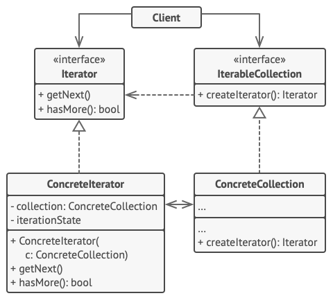

# 迭代器模式

迭代器模式（Iterator Pattern）是 Java 和 .Net 编程环境中非常常用的设计模式。这种模式用于顺序访问集合对象的元素，不需要知道集合对象的底层表示。

迭代器模式属于行为型模式。

## 介绍

**意图：**提供一种方法顺序访问一个聚合对象中各个元素, 而又无须暴露该对象的内部表示。

**主要解决：**不同的方式来遍历整个整合对象。

**何时使用：**遍历一个聚合对象。

**如何解决：**把在元素之间游走的责任交给迭代器，而不是聚合对象。

**关键代码：**定义接口：hasNext, next。

**应用实例：**JAVA 中的 iterator。

**优点：** 1、它支持以不同的方式遍历一个聚合对象。 2、迭代器简化了聚合类。 3、在同一个聚合上可以有多个遍历。 4、在迭代器模式中，增加新的聚合类和迭代器类都很方便，无须修改原有代码。

**缺点：**由于迭代器模式将存储数据和遍历数据的职责分离，增加新的聚合类需要对应增加新的迭代器类，类的个数成对增加，这在一定程度上增加了系统的复杂性。

**使用场景：** 1、访问一个聚合对象的内容而无须暴露它的内部表示。 2、需要为聚合对象提供多种遍历方式。 3、为遍历不同的聚合结构提供一个统一的接口。

**注意事项：**迭代器模式就是分离了集合对象的遍历行为，抽象出一个迭代器类来负责，这样既可以做到不暴露集合的内部结构，又可让外部代码透明地访问集合内部的数据。

**迭代器模式结构**

**迭代器**（Iterator）接口声明了遍历集合所需的操作：获取下一个元素、获取当前位置和重新开始迭代等。

**具体迭代器**（Concrete Iterators）实现遍历集合的一种特定算法。迭代器对象必须跟踪自身遍历的进度。这使得多个迭代器可以相互独立地遍历同一集合。

**集合**（Collection）接口声明一个或多个方法来获取与集合兼容的迭代器。请注意，返回方法的类型必须被声明为迭代器接口，因此具体集合可以返回各种不同种类的迭代器。

**具体集合**（Concrete Collections）会在客户端请求迭代器时返回一个特定的具体迭代器类实体。你可能会琢磨，剩下的集合代码在什么地方呢？不用担心，它也会在同一个类中。只是这些细节对于实际模式来说并不重要，所以我们将其省略了而已。

**客户端**（Client）通过集合和迭代器的接口与两者进行交互。这样一来客户端无需与具体类进行耦合，允许同一客户端代码使用各种不同的集合和迭代器。

客户端通常不会自行创建迭代器，而是会从集合中获取。但在特定情况下，客户端可以直接创建一个迭代器（例如当客户端需要自定义特殊迭代器时）。

## 实现

我们将创建一个叙述导航方法的 *Iterator* 接口和一个返回迭代器的 *Container* 接口。实现了 *Container* 接口的实体类将负责实现 *Iterator* 接口。

*IteratorPatternDemo*，我们的演示类使用实体类 *NamesRepository* 来打印 *NamesRepository* 中存储为集合的 *Names*。

