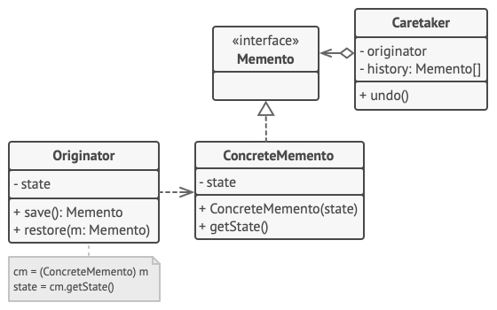

# 备忘录模式

备忘录模式（Memento Pattern）保存一个对象的某个状态，以便在适当的时候恢复对象。备忘录模式属于行为型模式。

## 介绍

**意图：**在不破坏封装性的前提下，捕获一个对象的内部状态，并在该对象之外保存这个状态。

**主要解决：**所谓备忘录模式就是在不破坏封装的前提下，捕获一个对象的内部状态，并在该对象之外保存这个状态，这样可以在以后将对象恢复到原先保存的状态。

**何时使用：**很多时候我们总是需要记录一个对象的内部状态，这样做的目的就是为了允许用户取消不确定或者错误的操作，能够恢复到他原先的状态，使得他有"后悔药"可吃。

**如何解决：**通过一个备忘录类专门存储对象状态。

**关键代码：**客户不与备忘录类耦合，与备忘录管理类耦合。

**应用实例：** 1、后悔药。 2、打游戏时的存档。 3、Windows 里的 ctrl + z。 4、IE 中的后退。 5、数据库的事务管理。

**优点：** 1、给用户提供了一种可以恢复状态的机制，可以使用户能够比较方便地回到某个历史的状态。 2、实现了信息的封装，使得用户不需要关心状态的保存细节。

**缺点：**消耗资源。如果类的成员变量过多，势必会占用比较大的资源，而且每一次保存都会消耗一定的内存。

**使用场景：** 1、需要保存/恢复数据的相关状态场景。 2、提供一个可回滚的操作。

**注意事项：** 1、为了符合迪米特原则，还要增加一个管理备忘录的类。 2、为了节约内存，可使用原型模式+备忘录模式。

**备忘录模式结构**

**基于嵌套类的实现**

该模式的经典实现方式依赖于许多流行编程语言（例如 C++、C# 和 Java）所支持的嵌套类。

**原发器**（Originator）类可以生成自身状态的快照，也可以在需要时通过快照恢复自身状态。

**备忘录**（Memento）是原发器状态快照的值对象（value object）。通常做法是将备忘录设为不可变的，并通过构造函数一次性传递数据。

**负责人**（Caretaker）仅知道 “何时” 和 “为何” 捕捉原发器的状态，以及何时恢复状态。

负责人通过保存备忘录栈来记录原发器的历史状态。当原发器需要回溯历史状态时，负责人将从栈中获取最顶部的备忘录，并将其传递给原发器的恢复（restoration）方法。

在该实现方法中，备忘录类将被嵌套在原发器中。这样原发器就可访问备忘录的成员变量和方法，即使这些方法被声明为私有。另一方面，负责人对于备忘录的成员变量和方法的访问权限非常有限：它们只能在栈中保存备忘录，而不能修改其状态。

### 基于中间接口的实现

另外一种实现方法适用于不支持嵌套类的编程语言（没错，我说的就是 PHP）。

在没有嵌套类的情况下，你可以规定负责人仅可通过明确声明的中间接口与备忘录互动，该接口仅声明与备忘录元数据相关的方法，限制其对备忘录成员变量的直接访问权限。

另一方面，原发器可以直接与备忘录对象进行交互，访问备忘录类中声明的成员变量和方法。这种方式的缺点在于你需要将备忘录的所有成员变量声明为公有。

**封装更加严格的实现**

如果你不想让其他类有任何机会通过备忘录来访问原发器的状态，那么还有另一种可用的实现方式。

这种实现方式允许存在多种不同类型的原发器和备忘录。每种原发器都和其相应的备忘录类进行交互。原发器和备忘录都不会将其状态暴露给其他类。

负责人此时被明确禁止修改存储在备忘录中的状态。但负责人类将独立于原发器，因为此时恢复方法被定义在了备忘录类中。

每个备忘录将与创建了自身的原发器连接。原发器会将自己及状态传递给备忘录的构造函数。由于这些类之间的紧密联系，只要原发器定义了合适的设置器（setter），备忘录就能恢复其状态。

## 实现

备忘录模式使用三个类 *Memento*、*Originator* 和 *CareTaker*。Memento 包含了要被恢复的对象的状态。Originator 创建并在 Memento 对象中存储状态。Caretaker 对象负责从 Memento 中恢复对象的状态。

*MementoPatternDemo*，我们的演示类使用 *CareTaker* 和 *Originator* 对象来显示对象的状态恢复。

