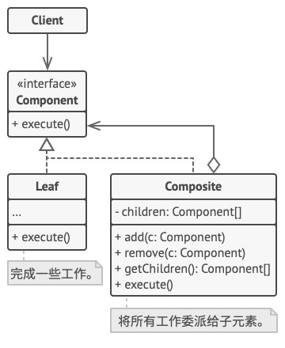

# 组合模式

组合模式（Composite Pattern），又叫部分整体模式，是用于把一组相似的对象当作一个单一的对象。组合模式依据树形结构来组合对象，用来表示部分以及整体层次。这种类型的设计模式属于结构型模式，它创建了对象组的树形结构。

这种模式创建了一个包含自己对象组的类。该类提供了修改相同对象组的方式。

我们通过下面的实例来演示组合模式的用法。实例演示了一个组织中员工的层次结构。

## 介绍

**意图：**将对象组合成树形结构以表示"部分-整体"的层次结构。组合模式使得用户对单个对象和组合对象的使用具有一致性。

**主要解决：**它在我们树型结构的问题中，模糊了简单元素和复杂元素的概念，客户程序可以像处理简单元素一样来处理复杂元素，从而使得客户程序与复杂元素的内部结构解耦。

**何时使用：** 1、您想表示对象的部分-整体层次结构（树形结构）。 2、您希望用户忽略组合对象与单个对象的不同，用户将统一地使用组合结构中的所有对象。

**如何解决：**树枝和叶子实现统一接口，树枝内部组合该接口。

**关键代码：**树枝内部组合该接口，并且含有内部属性 List，里面放 Component。

**应用实例：** 1、算术表达式包括操作数、操作符和另一个操作数，其中，另一个操作数也可以是操作数、操作符和另一个操作数。 2、在 JAVA AWT 和 SWING 中，对于 Button 和 Checkbox 是树叶，Container 是树枝。

**优点：** 1、高层模块调用简单。 2、节点自由增加。

**缺点：**在使用组合模式时，其叶子和树枝的声明都是实现类，而不是接口，违反了依赖倒置原则。

**使用场景：**部分、整体场景，如树形菜单，文件、文件夹的管理。

**注意事项：**定义时为具体类。

**组件**（Component）接口描述了树中简单项目和复杂项目所共有的操作。

**叶节点**（Leaf）是树的基本结构，它不包含子项目。

一般情况下，叶节点最终会完成大部分的实际工作，因为它们无法将工作指派给其他部分。

**容器**（Container）——又名 “组合（Composite）”——是包含叶节点或其他容器等子项目的单位。容器不知道其子项目所属的具体类，它只通过通用的组件接口与其子项目交互。

容器接收到请求后会将工作分配给自己的子项目，处理中间结果，然后将最终结果返回给客户端。

**客户端**（Client）通过组件接口与所有项目交互。因此，客户端能以相同方式与树状结构中的简单或复杂项目交互。

## 实现

我们有一个类 *Employee*，该类被当作组合模型类。*CompositePatternDemo* 类使用 *Employee* 类来添加部门层次结构，并打印所有员工。

