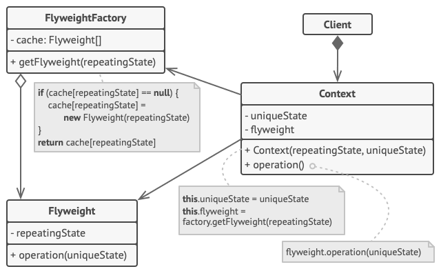

# 享元模式

享元模式（Flyweight Pattern）主要用于减少创建对象的数量，以减少内存占用和提高性能。这种类型的设计模式属于结构型模式，它提供了减少对象数量从而改善应用所需的对象结构的方式。

享元模式尝试重用现有的同类对象，如果未找到匹配的对象，则创建新对象。我们将通过创建 5 个对象来画出 20 个分布于不同位置的圆来演示这种模式。由于只有 5 种可用的颜色，所以 color 属性被用来检查现有的 *Circle* 对象。

## 介绍

**意图：**运用共享技术有效地支持大量细粒度的对象。

**主要解决：**在有大量对象时，有可能会造成内存溢出，我们把其中共同的部分抽象出来，如果有相同的业务请求，直接返回在内存中已有的对象，避免重新创建。

**何时使用：** 1、系统中有大量对象。 2、这些对象消耗大量内存。 3、这些对象的状态大部分可以外部化。 4、这些对象可以按照内蕴状态分为很多组，当把外蕴对象从对象中剔除出来时，每一组对象都可以用一个对象来代替。 5、系统不依赖于这些对象身份，这些对象是不可分辨的。

**如何解决：**用唯一标识码判断，如果在内存中有，则返回这个唯一标识码所标识的对象。

**关键代码：**用 HashMap 存储这些对象。

**应用实例：** 1、JAVA 中的 String，如果有则返回，如果没有则创建一个字符串保存在字符串缓存池里面。 2、数据库的连接池。

**优点：**大大减少对象的创建，降低系统的内存，使效率提高。

**缺点：**提高了系统的复杂度，需要分离出外部状态和内部状态，而且外部状态具有固有化的性质，不应该随着内部状态的变化而变化，否则会造成系统的混乱。

**使用场景：** 1、系统有大量相似对象。 2、需要缓冲池的场景。

**注意事项：** 1、注意划分外部状态和内部状态，否则可能会引起线程安全问题。 2、这些类必须有一个工厂对象加以控制。

享元模式只是一种优化。在应用该模式之前，你要确定程序中存在与大量类似对象同时占用内存相关的内存消耗问题，并且确保该问题无法使用其他更好的方式来解决。

**享元**（Flyweight）类包含原始对象中部分能在多个对象中共享的状态。同一享元对象可在许多不同情景中使用。享元中存储的状态被称为“内在状态”。传递给享元方法的状态被称为“外在状态”。

**情景**（Context）类包含原始对象中各不相同的外在状态。情景与享元对象组合在一起就能表示原始对象的全部状态。

通常情况下，原始对象的行为会保留在享元类中。因此调用享元方法必须提供部分外在状态作为参数。但你也可将行为移动到情景类中，然后将连入的享元作为单纯的数据对象。

**客户端**（Client）负责计算或存储享元的外在状态。在客户端看来，享元是一种可在运行时进行配置的模板对象，具体的配置方式为向其方法中传入一些情景数据参数。

**享元工厂**（Flyweight Factory）会对已有享元的缓存池进行管理。有了工厂后，客户端就无需直接创建享元，它们只需调用工厂并向其传递目标享元的一些内在状态即可。工厂会根据参数在之前已创建的享元中进行查找，如果找到满足条件的享元就将其返回；如果没有找到就根据参数新建享元。

## 实现

我们将创建一个 *Shape* 接口和实现了 *Shape* 接口的实体类 *Circle*。下一步是定义工厂类 *ShapeFactory*。

*ShapeFactory* 有一个 *Circle* 的 *HashMap*，其中键名为 *Circle* 对象的颜色。无论何时接收到请求，都会创建一个特定颜色的圆。*ShapeFactory* 检查它的 *HashMap* 中的 circle 对象，如果找到 *Circle* 对象，则返回该对象，否则将创建一个存储在 hashmap 中以备后续使用的新对象，并把该对象返回到客户端。

*FlyWeightPatternDemo* 类使用 *ShapeFactory* 来获取 *Shape* 对象。它将向 *ShapeFactory* 传递信息（*red / green / blue/ black / white*），以便获取它所需对象的颜色。

